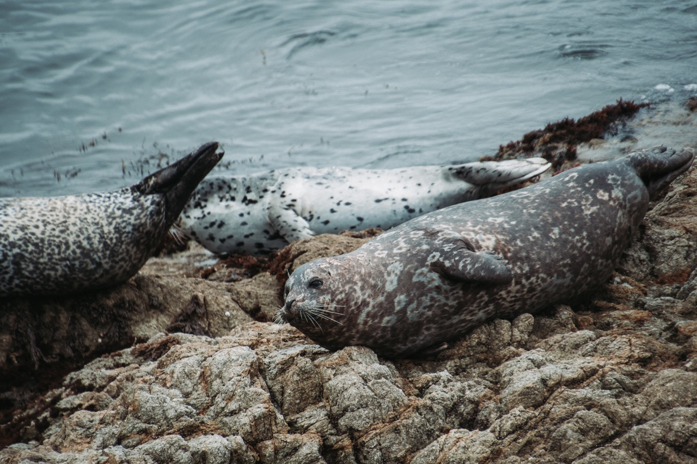

One of the hobbies I enjoy doing on the go is photography.
Whenever I'm traveling or visiting somewhere new, I grab my camera along for the ride.
In fact, the photo you see in the table of contents and on the landing page was taken by yours truly.

Landscapes have to be my favorite style of photos to take.
The planet is naturally gorgeous and provides so many amazing opportunities, all I have to do is frame and shoot!

  
   
   
   
   
   
   
   
   
   
   
   
   
   
   
   
   
   
  

Hover over a photo (click on mobile) to view the images in color!
{:.figcaption}

If you want to see more photos I've taken, as well as any new ones in the future, check out my Instagram!
I post pictures from my adventures and occasionally of portraits I take for my friends.